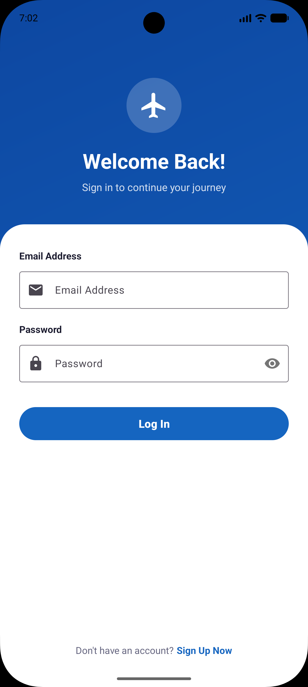
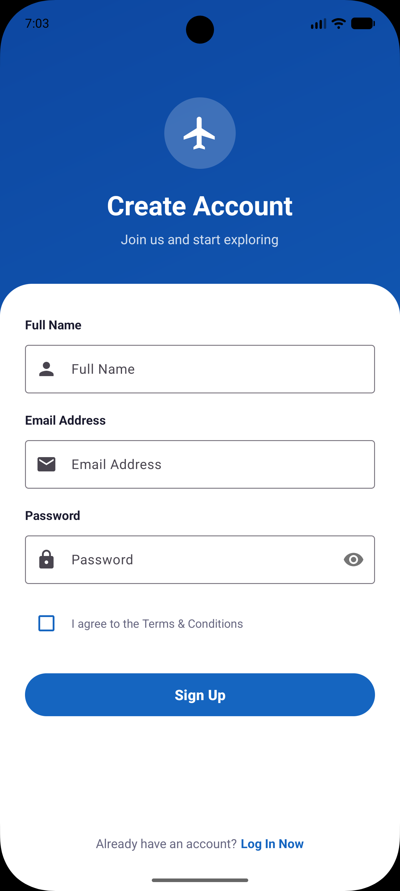
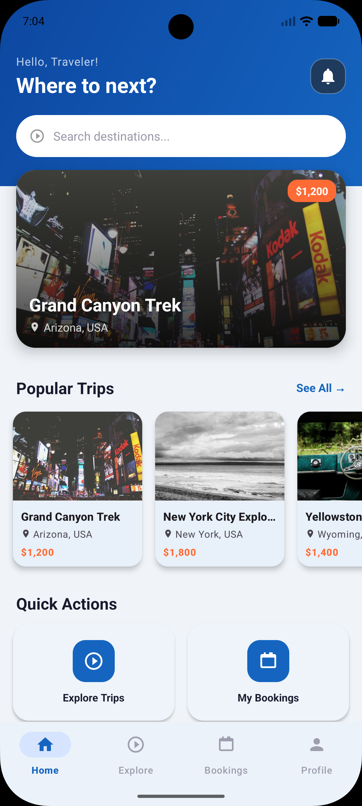
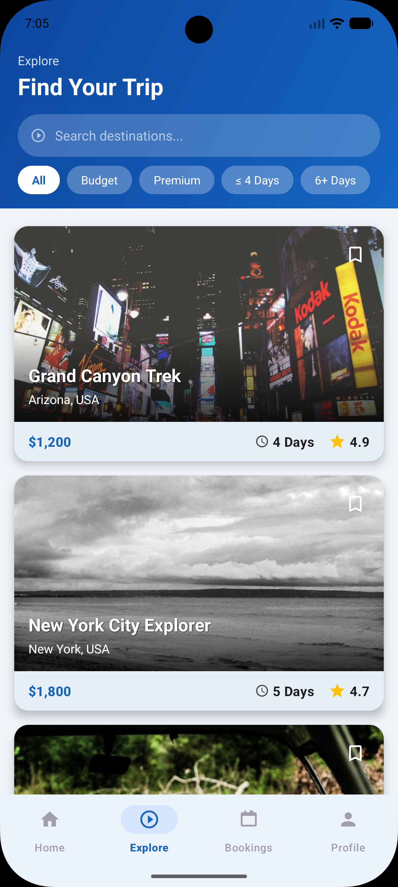
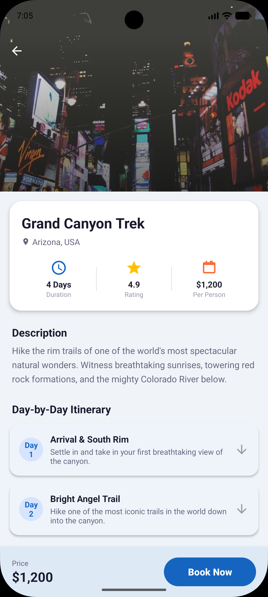
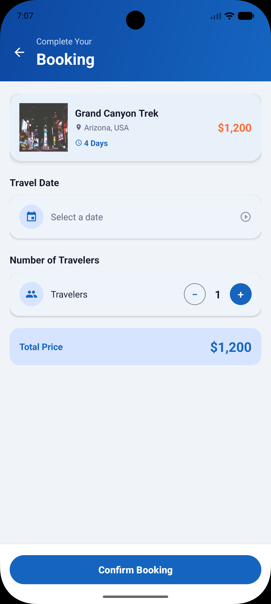
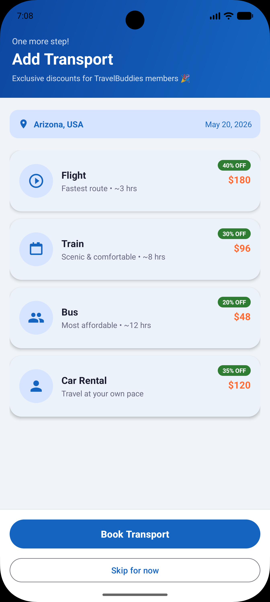
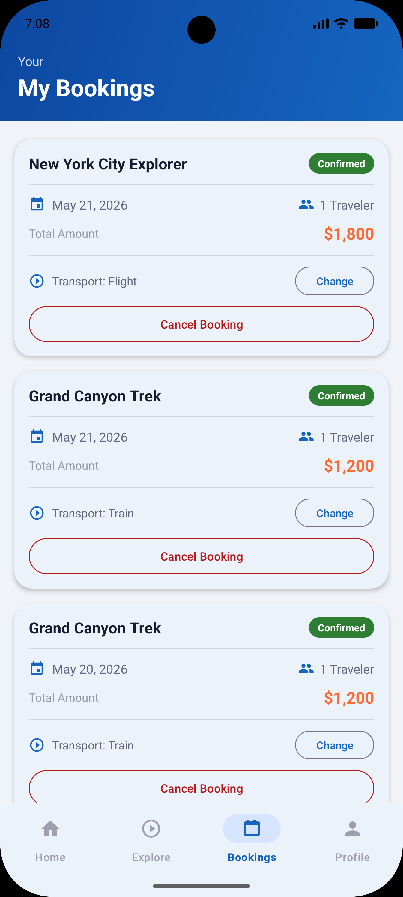
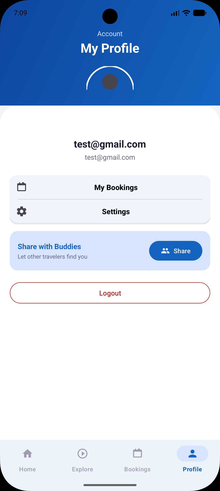

# TravelBuddies

A social travel planning Android app that lets users discover trips, build itineraries, book experiences, and connect with fellow travelers.

---

## Screenshots

| Login | Sign Up | Home |
|-------|---------|------|
|  |  |  |

| Explore | Trip Itinerary | Booking |
|---------|---------------|---------|
|  |  |  |

| Transport | My Bookings | Profile |
|-----------|-------------|---------|
|  |  |  |

---

## Features

- **Explore** — Browse curated trip cards with images, price, rating, and duration. Live search by destination or trip name with filter pills (All / Budget / Premium / ≤ 4 Days / 6+ Days).
- **Trip Detail** — Full trip view with collapsing hero image, key stats, day-by-day itinerary (expandable cards), travel buddies, location with Maps integration.
- **Booking** — Select travel date and number of travelers, save booking to local DB, then optionally add a transport mode (Flight / Train / Bus / Car Rental) at a discounted rate.
- **My Bookings** — View all confirmed bookings, manage or change transport, cancel with confirmation dialog.
- **Profile** — User info, quick links to bookings and settings, share invite with friends.
- **Splash Screen** — Branded blue splash with logo, app name, and loading indicator. Configured for Android 12+ system splash screen API.

---

## Tech Stack

| Layer | Technology |
|---|---|
| Language | Java |
| Min SDK | 24 (Android 7.0) |
| Target / Compile SDK | 36 |
| UI | Android Views, ViewBinding, Material3 |
| Navigation | AndroidX Navigation Component (NavHostFragment + BottomNavigationView) |
| Local DB | SQLite via `SQLiteOpenHelper` (DBHelper) |
| Session | SharedPreferences via SessionManager |
| Image Loading | Glide |
| Architecture | Single-activity with fragments for main tabs, separate activities for detail flows |

---

## Project Structure

```
app/src/main/java/com/example/travelbuddies/
├── activities/
│   ├── SplashActivity       # Launch screen + DB seeding
│   ├── LoginActivity
│   ├── SignupActivity
│   ├── MainActivity         # BottomNavigationView host
│   ├── TripDetailActivity   # Collapsing toolbar, itinerary, map
│   ├── BookingActivity      # Date picker, people counter
│   └── TransportActivity    # Transport upsell after booking
├── fragments/
│   ├── HomeFragment         # Featured trip + quick actions
│   ├── TripFragment         # Explore tab with search & filter
│   ├── DashboardFragment    # My Bookings tab
│   └── ProfileFragment
├── adapters/
│   ├── TripAdapter
│   ├── BookingAdapter
│   ├── ItineraryAdapter
│   └── BuddyAdapter
├── database/
│   └── DBHelper             # SQLite v3 — users, trips, bookings, transport, itinerary
├── models/
│   ├── Trip
│   ├── Booking
│   ├── User
│   └── ItineraryDay
└── utils/
    ├── SessionManager
    └── Constants
```

---

## Database Schema

| Table | Purpose |
|---|---|
| `users` | Registered accounts |
| `trips` | Trip catalogue (seeded on first launch) |
| `bookings` | User bookings linked to trips |
| `transport_bookings` | Optional transport per booking |
| `itinerary` | Day-by-day plans per trip (seeded on first open of trip detail) |

---

## Getting Started

1. Clone the repo.
2. Open in **Android Studio Hedgehog** or later.
3. Let Gradle sync.
4. Run on an emulator or device with **Android 7.0+**.

> No API keys or backend setup required — all data is local (SQLite + SharedPreferences).

---

## Notes

- Sample trip data and itineraries are seeded automatically on first launch.
- Trip images are loaded from `picsum.photos` — an internet connection is required for images to appear.
- The package name `com.example.travelbuddies` is a placeholder and should be updated before publishing to the Play Store.
